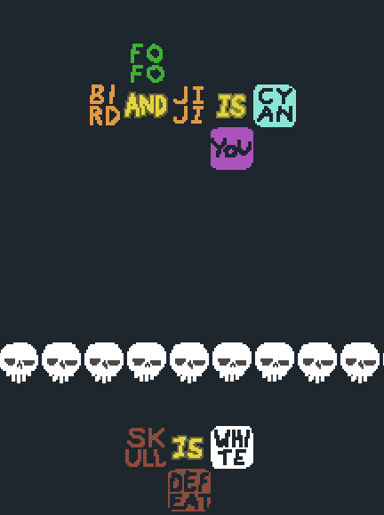

Geez, this was a complex mod for a toy idea.

# Baba is You Mod - Omni Connectors
Adds variants of all connector texts (is, has, near, facing, make, etc) where sentence parsing can split in both directions, creating...interesting sentence layouts.

So stuff like this ~~abomination~~ is possible:

Or this fun layout:

# Installation

**Currently only supports beta version 398 on PC.**

To install, copy both Lua and Sprites folder into the levelpack you want to include the mod. Make sure the `world_data.txt` in the levelpack folder has `mods=1` set underneath the `[General]` section.

## **A few disclaimers/notes**
- This is more of a "What if" mod than something intended to add good content to the game. If it feels weird and complicated, I wouldn't be surprised.
- This mod heavily deals with the rule parsing logic, which has many layers of complexity (Also flawed in some areas). If there's a bug with this mod somewhere, feel free to report it, but theres a chance that it won't be addressed due to said complexity. 

# Version History
- **1.0.0** (3/26/21)
  - Initial release